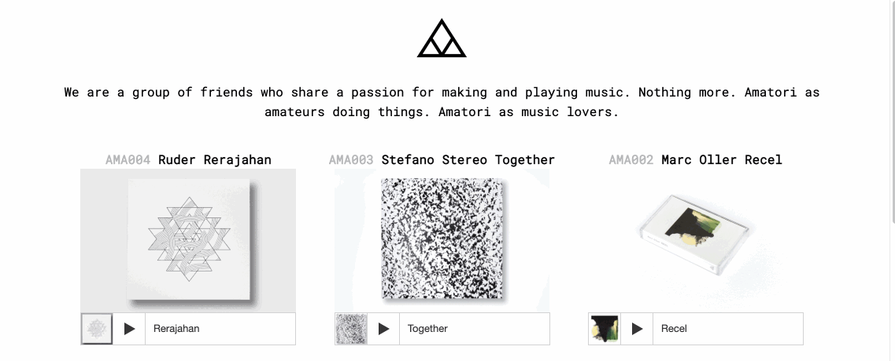

## Amatori — Website

Static site for showcasing the music releases of the Amatori collective.

Live site: http://amatori.net/

### Technologies

- HTML (semantic) and CSS
- Minimal JavaScript where required — intentionally framework-free

### Highlights

- Lightweight, accessible markup and styles
- Bandcamp and Soundcloud embeds for direct listening - intentionally database-free
- Designed to be easy to edit and reuse as a simple template

### Development approach

The project prioritises clarity and maintainability: no preprocessors, no unnecessary frameworks. Choices such as avoiding BEM or a React rewrite are intentional — plain, well-organised HTML/CSS/JS keeps the codebase small and easy to evolve.

### Deployment

This repository is served via GitHub Pages. The `CNAME` file configures a custom domain (`www.amatori.net`).

### Contributing

Issues and pull requests are welcome. Keep changes focused and minimal. Accessibility and semantic improvements are particularly appreciated.
